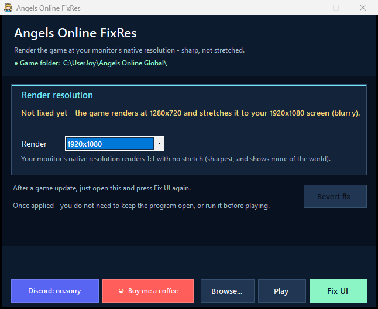
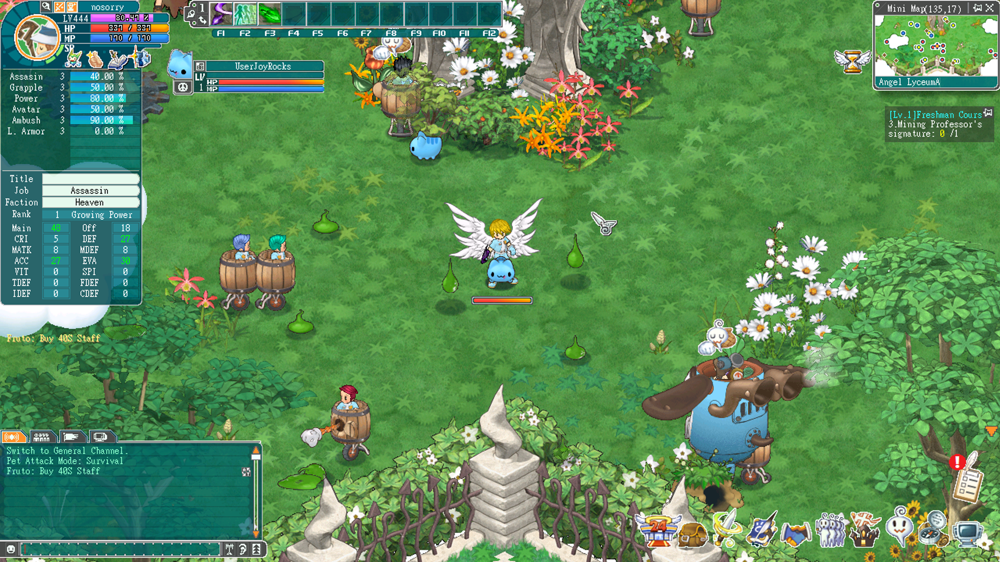
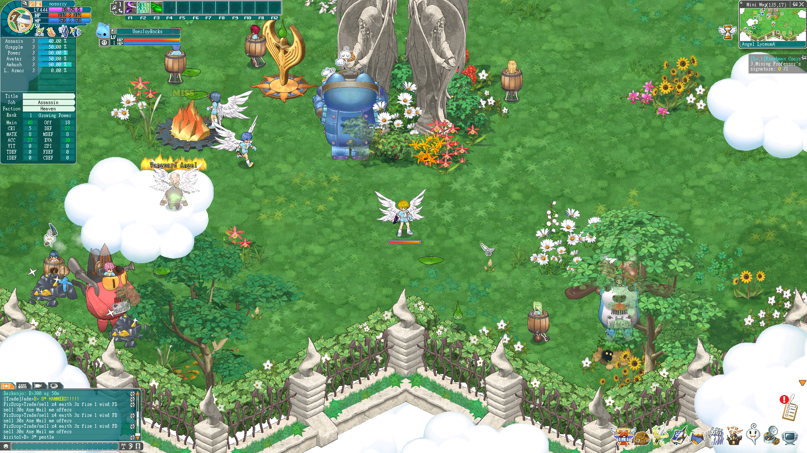

# Angels Online FixRes

A small Windows tool that makes the MMO *Angels Online Global* **fill your whole
screen, sharply**, in a clean borderless-fullscreen window - instead of a small,
blurry, zoomed-in stretch or a tiny window in the corner of a big monitor.

The game draws its world at a small fixed size and then stretches that picture onto
your screen. On modern monitors that stretch is set up badly: on a 1080p screen it's
a soft 1.5x magnification, and on a 4K, 5K, or ultrawide screen the game often ends
up in a small window instead of filling the display at all. This tool fixes the
stretch so the picture fills your entire monitor in a borderless-fullscreen window,
and it renders a 1920x1080 layout (up from the game's default 720p) so the interface
is sharper than the stock blurry stretch. It backs up your files first and can be
reverted at any time.

It ships as a single executable with **no prerequisites** - no .NET, Python, or
anything else to install. Download it and run.



## Before and after

The same spot in-game: the stock blurry, low-resolution stretch (before) vs. the
tool's sharp, full-screen picture (after).

| Before (blurry, low-res stretch) | After (sharp, fills your screen) |
|:---:|:---:|
|  |  |

---

## Features

- **Fills any monitor larger than 1080p.** 4K, 5K, ultrawide, and tall 16:10 panels
  (e.g. 1920x1200, 2560x1600) run borderless-fullscreen and fill the whole screen
  automatically. It detects *your* monitor; nothing is hardcoded to one screen. Odd
  sizes at or below 1080p fall back to a clean window.
- **Sharper than stock.** On big monitors it renders a full 1920x1080 layout (up from
  the game's default 720p), then the game's own Direct2D present stretches that to
  fill your screen - so the interface and edges are sharper than the stock soft
  1.5x stretch.
- **Borderless-fullscreen done right.** No black-screen flicker when you Alt-Tab, and
  the game keeps running and rendering while you're tabbed out - no minimizing, no
  freezing.
- **One click.** Press **Fix UI** and it's done. Press **Play** to fix and launch in
  one step. There's nothing to configure - the tool picks the right setting for your
  screen.
- **Safe.** It backs up `angel.dat` (and `midage.ini` if present) first, and it will
  **refuse** to touch a client it doesn't recognize, so a future game update can never
  make it corrupt your install.
- **Survives updates.** If a game update overwrites the client, just run the tool
  again to re-apply.

---

## Download and run

1. Open the [Releases](../../releases) page and download the latest
   `AngelsOnlineFixRes.exe`.
2. **Close Angels Online** if it's open (the client file is locked while it runs; the
   fix takes effect on the next launch).
3. Run `AngelsOnlineFixRes.exe`. If it doesn't find the game automatically, click
   **Browse...** and select your Angels Online Global folder (the one with
   `angel.dat` and `START.EXE`).
4. Press **Fix UI**, then launch the game - or just press **Play** to fix and launch
   together.

A standard install lives at:

```text
C:\UserJoy\Angels Online Global
```

---

## Is it safe? (Windows SmartScreen)

`AngelsOnlineFixRes.exe` is new software from an independent developer and isn't
code-signed with a paid certificate, so Windows SmartScreen may show a blue
**"Windows protected your PC"** notice the first time you run it. That notice means
Windows hasn't seen this exact file many times yet. It is not a virus warning, and
the tool is not malware.

To run it:

1. Click **More info**.
2. Click **Run anyway**.

Prefer to verify first? You have options:

- **Scan it.** Upload the file to [VirusTotal](https://www.virustotal.com/) or paste
  the hash below.
- **Check the hash.** The SHA-256 of `AngelsOnlineFixRes.exe` for v1.2.0 is:

  ```text
  B9C61AA284BCFA656AA6B00884E4C620B5A31386B3A425E1F50B9FBA46A81290
  ```

  Verify it on your machine with:

  ```powershell
  Get-FileHash .\AngelsOnlineFixRes.exe -Algorithm SHA256
  ```

- **Read what it does.** The full method is documented in
  [docs/how-it-works.md](docs/how-it-works.md) - nothing is hidden about how the fix
  works.

The SmartScreen notice fades as more people download and run the tool.

---

## How to use

1. Run the tool. Green status at the top means it found your game; red means click
   **Browse...** and pick your Angels Online Global folder.
2. The card shows the current state. "renders at 1280x720 and stretches it" is the
   problem this fixes; "Fix is active" means you're already sorted.
3. Press **Fix UI** and confirm.
4. Launch the game - or use **Play** to fix and launch together. The game now fills
   your screen.

> **On an ultrawide / 21:9 screen**, the game fills the full width, and because the
> game's picture is 16:9 it's stretched a little at the sides to reach the edges. On
> 16:9 monitors (including 4K and 5K) there's no stretch.

---

## Reverting

Don't like it? Click **Revert fix** in the app to restore the most recent clean
(unpatched) backup of your current client.

Every fix also writes timestamped `.fixres.bak` backups next to the originals, so you
can revert by hand too: delete the current file and rename the latest
`angel.dat.*.fixres.bak` / `midage.ini.*.fixres.bak` back to `angel.dat` /
`midage.ini`.

---

## How it works

Short version: the game draws its world at a small fixed size and stretches it onto
your screen with Direct2D. The tool configures the game to run borderless-fullscreen
and makes that stretch fill your entire monitor, sharply. It does **not** inject code
or touch your account - only render geometry and window behavior.

The full technical write-up - what the client actually does, the discovery that its
world is drawn at a baked size that no resolution setting can change, and exactly
what the tool edits and why it's safe - is in
[docs/how-it-works.md](docs/how-it-works.md).

For the version history, see [CHANGELOG.md](CHANGELOG.md).

---

## Contact

Found a bug or a problem? Reach out on Discord: **no.sorry**

You can also click the **Discord: no.sorry** button in the bottom-left of the app to
copy the username to your clipboard.

---

<p align="center">
  
</p>
